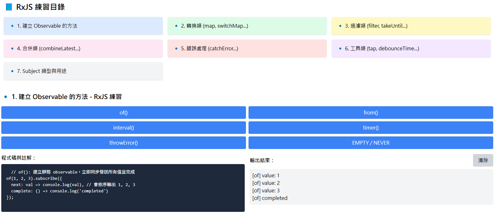

# 📘 RxJS 練習專案 (Angular)

[](https://angular.io/)
[](https://rxjs.dev/)
[](LICENSE)


本專案整理並實作了 RxJS 在 Angular 中的常用操作符，並依功能分類為 7 個練習分頁，每頁皆提供互動按鈕與輸出結果區塊。



## 0. 事前知識儲備

###  RxJS 是什麼？

RxJS（Reactive Extensions for JavaScript）是一個用於處理非同步事件的函式庫，提供了 Observable 物件來表示資料流，並提供了許多操作符來處理這些資料流。RxJS 的核心概念是「反應式編程 (Reactive Programming)」，它允許開發者以聲明式的方式來處理非同步事件，並且能夠輕鬆地組合、轉換和處理資料流。
RxJS 的主要特點包括：
- **Observable**：RxJS 的核心概念，表示一個資料流，可以是同步或非同步的。
- **Operators**：RxJS 提供了許多操作符來處理 Observable，例如 `map`、`filter`、`mergeMap` 等等。
- **Subjects**：RxJS 提供了多種 Subject 類型，例如 `Subject`、`BehaviorSubject`、`ReplaySubject` 等等，用於處理多播和狀態管理。
- **Schedulers**：RxJS 提供了多種排程器，用於控制 Observable 的執行時機，例如 `async`、`queue` 等等。
- **Error Handling**：RxJS 提供了多種錯誤處理機制，例如 `catchError`、`retry` 等等，用於處理 Observable 中的錯誤。
- **Testing**：RxJS 提供了測試工具，例如 `TestScheduler`，用於測試 Observable 的行為。

### 什麼是 Promise？

Promise 是 Javascript 原生語法的一部分，用於處理非同步操作。它表示一個尚未完成但最終會解決(resolve)或(reject)的值。
- **單一值**：
  - Promise 只能發出一個值，無法發出多個值。
  - 一旦狀態改變(從 pending 變為 resolved 或 rejected)，就無法再改變。
- **三種狀態**：
  - `pending`：初始狀態，表示 Promise 尚未完成。
  - `fulfilled`：表示 Promise 已成功完成，並返回一個值。
  - `rejected`：表示 Promise 已失敗，並返回一個錯誤。
- **鏈式調用**：
  - Promise 支援鏈式調用，可以使用 `then()` 和 `catch()` 方法來處理成功和失敗的結果。
- **不可取消**：
  - 一旦 Promise 開始執行，就無法取消它。
### 什麼是 Observable？

- 資料流的表示    
  - 是一種資料流的抽象表示，可以發出一系列的值，例如數據、事件、錯誤或完成信號。
- 多個值   
  - 與 Promise 不同，Observable 可以發出多個值，而不僅僅是單一的值。
- 延遲執行(Lazy Execution)    
  - Observable 是延遲執行的，只有當有訂閱者訂閱 subscribe()時，Observable 才會開始執行。
- 可取消的訂閱
  - Observable 可以透過 unsubscribe() 方法取消訂閱，這樣可以避免記憶體洩漏和不必要的計算。
- 支援多種操作符
  - Observable 提供了許多操作符，例如 map、filter、mergeMap 等等，可以用來轉換、過濾和組合資料流。
- 三種通知類型
  - Observable 可以發出三種通知類型：next、error 和 complete。
    - `next`：發出一個值。
    - `error`：發出錯誤通知，並終止 Observable。
    - `complete`：發出完成通知，並終止 Observable。
- 應用場景
  - 事件監聽
    - 監聽使用者輸入、按鈕點擊等事件。
  - HTTP 請求
    - 處理 API 請求的回應。
  - 資料流處理
    - 處理資料流的轉換、過濾和組合。
  - 非同步操作
    - 處理非同步操作的結果，例如計時器、WebSocket 等等。
---

## 🔹 1. 建立 Observable 的方法
| 操作符 | 說明 |
|--------|------|
| `of()` | 建立一個 observable，輸出靜態值。 |
| `from()` | 從 promise、陣列等建立 observable。 |
| `interval()` | 每隔一段時間發出一個值。 |
| `timer()` | 延遲發送第一個值，之後可設定週期。 |
| `throwError()` | 建立一個拋出錯誤的 observable。 |
| `EMPTY` / `NEVER` | 不發送值 / 永遠不結束的 observable。 |

### 1.1 `of()`
```typescript
of(...values: T[]): Observable<T>
```
#### 參數
- `...values`：要發出的靜態值，可以是任意數量的值。
- `T`：發出的值的類型。
- `Observable<T>`：返回一個 Observable 物件，當訂閱時會依序發出所有靜態值，然後完成。

#### 特性
- `of()` 發出的值是同步的，這意味著當訂閱者訂閱時，所有的值會立即發出。
- 適合用於發
- 出靜態的單一值或多個值。
- 再發出所有值後，會自動發出`complete` 通知，表示 Observable 已完成。

#### 使用場景
- 測試或模擬資料流。
- 初始化靜態資料。
- 組合其他 Operation 進行資料流處理。

### 1.2 `from()`
```typescript
from<T>(input: ObservableInput<T>): Observable<T>
```
#### 參數
- `input`：可以是 Promise、陣列、字串、可迭代物件等，這些物件都可以轉換為 Observable。
- `ObservableInput<T>`：表示可以轉換為 Observable 的輸入類型。
- `T`：發出的值的類型。輸入就是**一個**物件，輸出就是**一個**物件。
- `Observable<T>`：返回一個 Observable 物件，當訂閱時會依序發出所有的值，然後完成。

#### 特性
- 基本上跟 `of()` 類似，但 `from()` 可以處理 Promise、陣列等可迭代物件。

#### 跟 `of()` 的差異
```javascript
// 使用 of()
of([1, 2, 3]).subscribe(console.log); // 輸出: [1, 2, 3]（整個陣列作為單一值）
// 使用 from()
from([1, 2, 3]).subscribe(console.log); // 輸出: 1, 2, 3（逐個發出）
```

## 1.3 `interval()`
```typescript
interval(period: number, scheduler?: SchedulerLike): Observable<number>
```

#### 參數
- `period`：發出值的時間間隔，以毫秒為單位。
- `scheduler`：可選的排程器，用於控制 Observable 的執行時機。
- `SchedulerLike`：表示排程器的類型。
- `Observable<number>`：返回一個 Observable 物件，當訂閱時會每隔指定的時間間隔發出一個遞增的整數值。
- `number`：發出的值的類型。

#### 特性
- `interval()` 會返回一個無限的 Observable，會不斷地發出遞增的整數值。從 0 開始，每次發出值後會等待指定的時間間隔，然後再發出下一個值。
- 當訂閱者訂閱時，Observable 會開始計時，並在每個時間間隔發出一個遞增的整數值。
- 當訂閱者取消訂閱時，計時才會停止。

### 1.4 `timer()`
```typescript
timer(dueTime: number | Date, period?: number, scheduler?: SchedulerLike): Observable<number>
```

#### 參數
- `dueTime`：延遲發送第一個值的時間，可以是毫秒數或 Date 物件。
- `period`：可選的時間間隔，以毫秒為單位，表示後續發送值的時間間隔。
- `scheduler`：可選的排程器，用於控制 Observable 的執行時機。
- `SchedulerLike`：表示排程器的類型。
- `Observable<number>`：返回一個 Observable 物件，當訂閱時會在指定的時間延遲後發出第一個值，然後每隔指定的時間間隔發出後續的值。
- `number`：發出的值的類型。

#### 特性
- 延遲發送第一個值：
  - 可以指定延遲時間（毫秒或具體日期）來發送第一個值。
- 可選的固定間隔：
  - 可以設置 period，使 Observable 在第一個值後以固定間隔發送後續值。
- 非同步執行：
  - 使用非同步排程器（asyncScheduler），因此值的發送是非同步的。
- 有限或無限發送：
  - 如果未提供 period，則只發送第一個值並完成。
  - 如果提供了 period，則會無限發送值，直到訂閱者取消訂閱。

## 1.5 `throwError()`
```typescript
throwError(error: any): Observable<never>
```
#### 參數
- `error`：要發出的錯誤物件，可以是任何類型的錯誤。
- `any`：表示錯誤的類型。
- `Observable<never>`：返回一個 Observable 物件，當訂閱時會立即發出錯誤通知，並終止 Observable。
- `never`：表示這個 Observable 永遠不會發出任何值，因為它會立即發出錯誤通知並終止。
#### 特性
- `throwError()` 會立即發出錯誤通知，並終止 Observable。
- 當訂閱者訂閱時，Observable 會立即發出錯誤通知，並不會發出任何值。

### 1.6 `EMPTY` / `NEVER`
```typescript
const EMPTY = new Observable<never>((subscriber) => subscriber.complete());
export const NEVER = new Observable<never>(noop);
```
#### 參數
- `EMPTY`：表示一個不發送任何值的 Observable，當訂閱時會立即完成。
- `NEVER`：表示一個永遠不會完成的 Observable，當訂閱時不會發送任何值，也不會完成。

---

## 🔹 2. 轉換類 (Transformation Operators)
| 操作符 | 說明 |
|--------|------|
| `map()` | 對每個值做轉換。 |
| `switchMap()` | 取消前一個內層 observable，只訂閱最新的。 |
| `mergeMap()` / `flatMap()` | 平行訂閱多個 observable。 |
| `concatMap()` | 排隊等待前一個完成再訂閱下一個。 |
| `exhaustMap()` | 忽略新來的 observable，直到現有完成。 |

### 2.1 `map()`
```typescript
map<T, R>(project: (value: T, index: number) => R, thisArg?: any): Observable<R>
```
#### 參數
- `project`：轉換函式，接收每個值和索引，並返回轉換後的值。
- `thisArg`：可選的上下文物件，用於指定函式的 this 值。
- `T`：輸入值的類型。
- `R`：轉換後值的類型。
- `Observable<R>`：返回一個 Observable 物件，當訂閱時會對每個輸入值應用轉換函式，並發出轉換後的值。
- `number`：表示輸入值的索引。
#### 特性
- 逐一處理每個值：
  - `map()` 會對 Observable 發出的每個值應用轉換函式，並返回一個新的 Observable。
- 不會改變原始資料流結構：
  - `map()` 不會改變原始資料流的結構，只會對每個值進行轉換。
- 同步執行：
  - `map()` 是同步的，這意味著當訂閱者訂閱時，所有的值會立即發出。
- 適合用於簡單的轉換操作，例如數字運算、字串處理等。
- 可以鏈式調用：
  - `map()` 可以與其他操作符鏈式調用，例如 `filter()`、`mergeMap()` 等等。
#### 使用場景
- 當需要對 observable 發出的每個值進行轉換時，可以使用 map() 將其轉為新格式，例如轉為畫面需要的資料模型。
- 常用於簡單資料轉換，例如從後端回傳物件中擷取欄位。
#### 例子

> 這裡也說明一下 pipe() 的用法    
> `pipe()` 是 RxJS 中的一個方法，用於將多個操作符串接在一起，形成一個新的 Observable。這樣可以讓我們更方便地組合多個操作符，並且使程式碼更具可讀性。
```typescript
import { of } from 'rxjs';
import { map } from 'rxjs/operators';
const numbers$ = of(1, 2, 3, 4, 5);
const doubled$ = numbers$.pipe(
  map((value) => value * 2)
);
doubled$.subscribe((value) => console.log(value)); // 輸出: 2, 4, 6, 8, 10
```
### 2.2 `switchMap()`
```typescript
switchMap<T, R>(project: (value: T, index: number) => ObservableInput<R>, thisArg?: any): Observable<R>
```
#### 參數
- `project`：轉換函式，接收每個值和索引，並返回一個新的 Observable。
- `thisArg`：可選的上下文物件，用於指定函式的 this 值。
- `T`：輸入值的類型。
- `R`：轉換後值的類型。
- `Observable<R>`：返回一個 Observable 物件，當訂閱時會對每個輸入值應用轉換函式，並返回新的 Observable。
- `number`：表示輸入值的索引。
#### 特性
- 取消前一個內層 observable：
  - 當新的值進來時，`switchMap()` 會取消前一個內層 observable 的訂閱，只訂閱最新的。
- 只保留最新的值：
  - `switchMap()` 只會發出最新的值，前面的值會被忽略。
#### 使用場景
- 當需要依據使用者的最新操作（如搜尋輸入）取消前一次請求時，適合使用 switchMap()。
- 當每次事件觸發都應該只保留最新結果，例如 autocomplete 搜尋建議。
- 可避免過時請求結果覆蓋最新內容。

### 2.3 `mergeMap()`
```typescript
mergeMap<T, R>(project: (value: T, index: number) => ObservableInput<R>, thisArg?: any): Observable<R>
```
#### 參數
- `project`：轉換函式，接收每個值和索引，並返回一個新的 Observable。
- `thisArg`：可選的上下文物件，用於指定函式的 this 值。
- `T`：輸入值的類型。
- `R`：轉換後值的類型。
- `Observable<R>`：返回一個 Observable 物件，當訂閱時會對每個輸入值應用轉換函式，並返回新的 Observable。
#### 特性
- 平行訂閱多個 observable：
  - `mergeMap()` 會對每個輸入值應用轉換函式，並返回一個新的 Observable，這些 Observable 會平行訂閱。
- 無序發出值：
  - `mergeMap()` 會無序地發出所有 observable 的值，這意味著可能會在不同的時間點收到不同的值。
- 不會取消前一個 observable：
  - `mergeMap()` 不會取消前一個 observable 的訂閱，所有的 observable 都會同時執行。而 `switchMap()` 會取消舊的 observable 的訂閱，只保留最新的。
- 控制併發數量：
  - 可以使用 `concurrent` 參數來限制同時訂閱的 observable 數量。
- 合併多個 observable 的值：
  - `mergeMap()` 可以將多個 observable 的值合併成一個新的 observable，這樣可以更方便地處理多個資料流。
#### 使用場景
- 當需要同時處理多個資料流時，可以使用 mergeMap() 來平行訂閱這些 observable。
- 當需要將多個 observable 的值合併成一個新的 observable 時，可以使用 mergeMap() 來實現。
- 當需要對多個 observable 的結果進行合併處理時，可以使用 mergeMap() 來簡化程式碼。

## 2.4 `concatMap()`
```typescript
concatMap<T, R>(project: (value: T, index: number) => ObservableInput<R>, thisArg?: any): Observable<R>
```
#### 參數
- `project`：轉換函式，接收每個值和索引，並返回一個新的 Observable。
- `thisArg`：可選的上下文物件，用於指定函式的 this 值。
- `T`：輸入值的類型。
- `R`：轉換後值的類型。
- `Observable<R>`：返回一個 Observable 物件，當訂閱時會對每個輸入值應用轉換函式，並返回新的 Observable。
- `number`：表示輸入值的索引。
#### 特性
- 按順序處理每個 observable：
  - `concatMap()` 會對每個輸入值應用轉換函式，並返回一個新的 Observable，這些 Observable 會按順序訂閱。
- 保證順序：
  - `concatMap()` 會保證每個 observable 的值按順序發出，這意味著前一個 observable 完成後，才會訂閱下一個 observable。
- 不會平行訂閱：
  - `concatMap()` 不會平行訂閱多個 observable，而是依序處理每個 observable。
### 使用場景
- 當需要保證每個 observable 順序執行時，可以使用 concatMap()。
- 適合依序儲存多筆資料、寫入資料庫等場景。
- 可避免因非同步導致的資料錯亂問題。
### 範例
- 這裡寫一個範例，我們假設的狀況
  - 總共有三支API
  - 第二支會依賴第一支的結果
  - 第三支會依賴第二支的結果
```typescript
import { of } from 'rxjs';
import { concatMap, delay, map } from 'rxjs/operators';

demoSequentialApiCalls() {
  this.clear();
  this.currentCode = `// concatMap(): 按順序執行多個 API 請求，後續請求依賴前一個的結果\nof('Request 1').pipe(\n  concatMap(() => fakeApiCall('API 1')), // 第 1 隻 API\n  concatMap(result1 => fakeApiCall('API 2', result1)), // 第 2 隻 API，依賴第 1 隻的結果\n  concatMap(result2 => fakeApiCall('API 3', result2)) // 第 3 隻 API，依賴第 2 隻的結果\n).subscribe(finalResult => console.log('最終結果:', finalResult));`;

  of('Request 1')
    .pipe(
      concatMap(() => this.fakeApiCall('API 1')), // 第 1 隻 API
      concatMap(result1 => this.fakeApiCall('API 2', result1)), // 第 2 隻 API，依賴第 1 隻的結果
      concatMap(result2 => this.fakeApiCall('API 3', result2)) // 第 3 隻 API，依賴第 2 隻的結果
    )
    .subscribe(finalResult => this.addLog(`[API] 最終結果: ${finalResult}`));
}

// 模擬 API 請求
fakeApiCall(apiName: string, previousResult?: string) {
  return of(`結果來自 ${apiName}${previousResult ? `，基於: ${previousResult}` : ''}`).pipe(
    delay(1000) // 模擬 1 秒延遲
  );
}
```
### 2.5 `exhaustMap()`
```typescript
exhaustMap<T, R>(project: (value: T, index: number) => ObservableInput<R>, thisArg?: any): Observable<R>
```
#### 參數
- `project`：轉換函式，接收每個值和索引，並返回一個新的 Observable。
- `thisArg`：可選的上下文物件，用於指定函式的 this 值。
- `T`：輸入值的類型。
- `R`：轉換後值的類型。
- `Observable<R>`：返回一個 Observable 物件，當訂閱時會對每個輸入值應用轉換函式，並返回新的 Observable。
- `number`：表示輸入值的索引。
#### 特性
- 忽略新來的 observable：
  - 當內部的 observable 還在執行時，`exhaustMap()` 會忽略新的 observable，只處理當前的 observable。
- 當內部的 observable 完成後，才會訂閱新的 observable。
#### 使用場景
- 當不希望在前一個 observable 完成前處理新事件時，可使用 exhaustMap()。
- 常見於防止使用者連續點擊提交按鈕，避免重複請求。
- 只在空閒時接收新事件，其他事件會被忽略。
#### 範例
- 情境是我們有一顆按鈕可以觸發API請求，而我們假設這支API請求需要花費 3 秒鐘的時間來完成
  - 當我在這 3 秒鐘內不斷點擊按鈕的時候，照一般的情況下，會發出多個請求
  - 但如果我們使用 `exhaustMap()`，那麼在第一次請求完成之前，後續的請求都會被忽略
```typescript
  logs: string[] = [];

  ngOnInit() {
    const button = document.getElementById('apiButton');

    fromEvent(button!, 'click')
      .pipe(
        exhaustMap(() => this.fakeApiCall()) // 當前請求未完成時，忽略新的點擊事件
      )
      .subscribe(result => this.logs.push(result));
  }

  // 模擬 API 請求
  // 即使不斷點擊，直到前一個 API 結束，才會接受新點擊
  fakeApiCall() {
    const timestamp = new Date().toLocaleTimeString();
    return of(`API 回應於 ${timestamp}`).pipe(delay(3000)); // 模擬 3 秒延遲
  }
```

---

## 🔹 3. 過濾類 (Filtering Operators)
| 操作符 | 說明 |
|--------|------|
| `filter()` | 過濾不需要的值。 |
| `take(n)` | 只取前 n 個值。 |
| `takeUntil()` | 直到另一個 observable 發出值為止。 |
| `first()` / `last()` | 只取第一個 / 最後一個符合條件的值。 |
| `distinctUntilChanged()` | 避免連續重複的值發出。 |

### 3.1 `filter()`
```typescript
filter<T>(predicate: (value: T, index: number) => boolean, thisArg?: any): Observable<T>
```
#### 參數
- `predicate`：過濾函式，接收每個值和索引，並返回布林值。
- `thisArg`：可選的上下文物件，用於指定函式的 this 值。
- `T`：輸入值的類型。
- `Observable<T>`：返回一個 Observable 物件，當訂閱時會對每個輸入值應用過濾函式，並返回符合條件的值。
- `number`：表示輸入值的索引。
#### 特性
- 逐一處理每個值：
  - `filter()` 會對 Observable 發出的每個值應用過濾函式，並返回符合條件的值。
- 不會改變原始資料流結構：
  - `filter()` 不會改變原始資料流的結構，只會對每個值進行過濾。
- 同步執行：
  - `filter()` 是同步的，這意味著當訂閱者訂閱時，所有的值會立即發出。
- 適合用於簡單的過濾操作，例如數字範圍、字串匹配等。
- 可以鏈式調用：
  - `filter()` 可以與其他操作符鏈式調用，例如 `map()`、`mergeMap()` 等等。
#### 使用場景
- 當需要根據條件過濾不需要的值時，可以使用 filter()。
- 適合過濾掉不符合條件的輸入資料，例如只保留大於某個數值的數據。
#### 例子
```typescript
import { of } from 'rxjs';
import { filter } from 'rxjs/operators';
const numbers$ = of(1, 2, 3, 4, 5);
const evenNumbers$ = numbers$.pipe(
  filter(value => value % 2 === 0)
);
evenNumbers$.subscribe(value => console.log(value)); // 輸出: 2, 4
```

### 3.2 `take()`
```typescript
take<T>(count: number): Observable<T>
```
#### 參數
- `count`：要取的值的數量。
- `number`：表示要取的值的數量。
- `Observable<T>`：返回一個 Observable 物件，當訂閱時會發出前 count 個值，然後完成。
- `T`：輸入值的類型。
#### 特性
- 只取前 n 個值：
  - `take()` 會對 Observable 發出的前 count 個值進行訂閱，然後完成。
- 不會改變原始資料流結構：
  - `take()` 不會改變原始資料流的結構，只會對前 count 個值進行訂閱。
- 同步執行：
  - `take()` 是同步的，這意味著當訂閱者訂閱時，所有的值會立即發出。
- 適合用於簡單的取值操作，例如只需要前 n 個值。
- 可以鏈式調用：
  - `take()` 可以與其他操作符鏈式調用，例如 `filter()`、`map()` 等等。
#### 使用場景
- 當只想接收前 n 個資料項目時，可以使用 take(n)。
- 適用於只需初始幾個值、或限制觀察次數的情境。
#### 例子
```typescript
import { of } from 'rxjs';
import { take } from 'rxjs/operators';
const numbers$ = of(1, 2, 3, 4, 5);
const firstThree$ = numbers$.pipe(
  take(3)
);
firstThree$.subscribe(value => console.log(value)); // 輸出: 1, 2, 3
```
### 3.3 `takeUntil()`
```typescript
takeUntil<T>(notifier: ObservableInput<any>): Observable<T>
```
#### 參數
- `notifier`：當這個 observable 發出值時，停止訂閱。
- `ObservableInput<any>`：表示要停止訂閱的 observable。
- `Observable<T>`：返回一個 Observable 物件，當訂閱時會發出值，直到 notifier 發出值為止。
- `T`：輸入值的類型。
#### 特性
- 直到另一個 observable 發出值為止：
  - `takeUntil()` 會對 Observable 發出的值進行訂閱，直到 notifier 發出值為止。
- 不會改變原始資料流結構：
  - `takeUntil()` 不會改變原始資料流的結構，只會對前 count 個值進行訂閱。
- 同步執行：
  - `takeUntil()` 是同步的，這意味著當訂閱者訂閱時，所有的值會立即發出。
- 適合用於簡單的取值操作，例如只需要前 n 個值。
- 可以鏈式調用：
  - `takeUntil()` 可以與其他操作符鏈式調用，例如 `filter()`、`map()` 等等。
#### 使用場景
- 當需要在某個條件或事件發生時自動停止訂閱時，可以使用 takeUntil()。
- 適合用於元件銷毀時停止資料流，例如 componentDestroyed$ 的常見模式。
#### 例子
```typescript
import { interval, timer } from 'rxjs';
import { takeUntil } from 'rxjs/operators';

const source$ = interval(500); // 每 500ms 發一個值
const notifier$ = timer(2000); // 2 秒後停止

source$.pipe(
  takeUntil(notifier$)
).subscribe(val => console.log(val)); // 輸出: 0, 1, 2, 3
```
### 3.4 `first()`
```typescript
first<T>(predicate?: (value: T, index: number) => boolean, defaultValue?: T): Observable<T>
```
#### 參數
- `predicate`：可選的過濾函式，接收每個值和索引，並返回布林值。
- `defaultValue`：可選的預設值，當沒有符合條件的值時返回。
- `T`：輸入值的類型。
- `Observable<T>`：返回一個 Observable 物件，當訂閱時會發出第一個符合條件的值，然後完成。
- `number`：表示輸入值的索引。

#### 特性
- 只取第一個符合條件的值：
  - `first()` 會對 Observable 發出的每個值應用過濾函式，並返回第一個符合條件的值。
- 如果沒有符合條件的值，則返回預設值。
- 不會改變原始資料流結構：
  - `first()` 不會改變原始資料流的結構，只會對第一個符合條件的值進行訂閱。
- 同步執行：
  - `first()` 是同步的，這意味著當訂閱者訂閱時，所有的值會立即發出。
- 適合用於簡單的取值操作，例如只需要第一個符合條件的值。
- 可以鏈式調用：
  - `first()` 可以與其他操作符鏈式調用，例如 `filter()`、`map()` 等等。

#### 例子
```typescript
import { of } from 'rxjs';
import { first } from 'rxjs/operators';
const numbers$ = of(1, 2, 3, 4, 5);
const firstEven$ = numbers$.pipe(
  first(value => value % 2 === 0)
);
firstEven$.subscribe(value => console.log(value)); // 輸出: 2
```
### 3.5 `last()`
```typescript
last<T>(predicate?: (value: T, index: number) => boolean, defaultValue?: T): Observable<T>
```
#### 參數
- `predicate`：可選的過濾函式，接收每個值和索引，並返回布林值。
- `defaultValue`：可選的預設值，當沒有符合條件的值時返回。
- `T`：輸入值的類型。
- `Observable<T>`：返回一個 Observable 物件，當訂閱時會發出最後一個符合條件的值，然後完成。
- `number`：表示輸入值的索引。
#### 特性
- 只取最後一個符合條件的值：
  - `last()` 會對 Observable 發出的每個值應用過濾函式，並返回最後一個符合條件的值。
- 如果沒有符合條件的值，則返回預設值。
- 不會改變原始資料流結構：
  - `last()` 不會改變原始資料流的結構，只會對最後一個符合條件的值進行訂閱。
- 同步執行：
  - `last()` 是同步的，這意味著當訂閱者訂閱時，所有的值會立即發出。
- 適合用於簡單的取值操作，例如只需要最後一個符合條件的值。
- 可以鏈式調用：
  - `last()` 可以與其他操作符鏈式調用，例如 `filter()`、`map()` 等等。
#### 使用場景
- 當只需要 observable 的第一個或最後一個值時，可以使用 first() 或 last()。
- first() 常用於表單驗證流程中只取第一個錯誤，last() 則可用於收集過濾後的最終值。
#### 例子
```typescript
import { of } from 'rxjs';
import { last } from 'rxjs/operators';
const numbers$ = of(1, 2, 3, 4, 5);
const lastEven$ = numbers$.pipe(
  last(value => value % 2 === 0)
);
lastEven$.subscribe(value => console.log(value)); // 輸出: 4
```
### 3.6 `distinctUntilChanged()`
```typescript
distinctUntilChanged<T>(compare?: (x: T, y: T) => boolean): Observable<T>
```
#### 參數
- `compare`：可選的比較函式，接收前一個值和當前值，並返回布林值。
- `T`：輸入值的類型。
- `Observable<T>`：返回一個 Observable 物件，當訂閱時會發出不重複的值。
- `boolean`：表示前一個值和當前值是否相等。
#### 特性
- 過濾連續重複的值：
  - `distinctUntilChanged()` 會對 Observable 發出的每個值進行比較，並返回不重複的值。
- 如果前一個值和當前值相等，則不會發出當前值。
- 不會改變原始資料流結構：
  - `distinctUntilChanged()` 不會改變原始資料流的結構，只會對不重複的值進行訂閱。
- 同步執行：
  - `distinctUntilChanged()` 是同步的，這意味著當訂閱者訂閱時，所有的值會立即發出。
- 適合用於簡單的過濾操作，例如只需要不重複的值。
- 可以鏈式調用：
  - `distinctUntilChanged()` 可以與其他操作符鏈式調用，例如 `filter()`、`map()` 等等。
#### 使用場景
- 當需要避免連續重複的值被處理時，可以使用 distinctUntilChanged()。
- 適用於搜尋欄位輸入防抖（debounce）後避免同樣輸入重複觸發請求。
```typescript
import { of } from 'rxjs';
import { distinctUntilChanged } from 'rxjs/operators';
const numbers$ = of(1, 2, 2, 3, 4, 4, 5);
const distinctNumbers$ = numbers$.pipe(
  distinctUntilChanged()
);
distinctNumbers$.subscribe(value => console.log(value)); // 輸出: 1, 2, 3, 4, 5
```


---

## 🔹 4. 合併類 (Combination Operators)
| 操作符 | 說明 |
|--------|------|
| `combineLatest()` | 任一 observable 發出值時，組合所有最新值。 |
| `withLatestFrom()` | 取最新的其他 observable 值組合輸出。 |
| `forkJoin()` | 等所有 observable 結束後，發出最終結果。 |
| `zip()` | 多個 observable 同步依序組合輸出。 |
| `merge()` | 同時發出多個 observable 的所有值。 |
| `concat()` | 順序串接執行多個 observable。 |

---

## 🔹 5. 錯誤處理 (Error Handling)
| 操作符 | 說明 |
|--------|------|
| `catchError()` | 錯誤時回傳備援 observable。 |
| `retry(n)` | 發生錯誤時重試 n 次。 |
| `retryWhen()` | 自訂重試策略。 |
| `throwError()` | 主動建立錯誤 observable。 |

---

## 🔹 6. 工具類 (Utility Operators)
| 操作符 | 說明 |
|--------|------|
| `tap()` | 執行副作用（不改變值）。 |
| `finalize()` | observable 結束（含錯誤）時觸發。 |
| `delay()` | 延遲發送值。 |
| `debounceTime()` | 一段時間內只發出最後一個值。 |
| `auditTime()` / `throttleTime()` | 固定節流時間取樣值。 |
| `timeout()` | 若時間內未發出值則拋出錯誤。 |

---

## 🔹 7. Subject 類型與用途
| 類型 | 說明 |
|------|------|
| `Subject` | 多播，可發送資料給多個訂閱者。 |
| `BehaviorSubject` | 有初始值，訂閱時立即收到最後一筆。 |
| `ReplaySubject` | 記住過去 n 筆值，讓新訂閱者可收到。 |
| `AsyncSubject` | 結束時才發送最後一筆值給所有訂閱者。 |

---

## 🔹 8. 常見搭配 Angular 使用場景
| 場景 | 建議用法 |
|------|----------|
| HTTP 請求 | `switchMap` + `catchError` |
| 表單輸入防抖 | `debounceTime` + `distinctUntilChanged` |
| 等待多個 API 結束 | `forkJoin()` |
| 路由參數變化處理 | `combineLatest()` 或 `switchMap()` |
| 管理狀態變化 | `BehaviorSubject` |
| 組件取消訂閱 | `takeUntil(this.destroy$)` |

---

## ✅ 建議特別熟練的操作符
- `switchMap`, `tap`, `catchError`, `combineLatest`, `takeUntil`, `BehaviorSubject`

---

## 📎 補充學習建議
- 了解 Observable 與 Promise 的差異。
- 學習 RxJS 與 async/await 的整合方式（搭配 `firstValueFrom()`）。
- 善用 `takeUntil` 避免記憶體洩漏。
- 可搭配 DevTool（如 Augury）觀察 Angular 中資料流。

---

## ▶️ 使用方式

```bash
npm install
ng serve -o
```
開啟瀏覽器並造訪 http://localhost:4200
透過上方導覽點選各頁進行練習。
